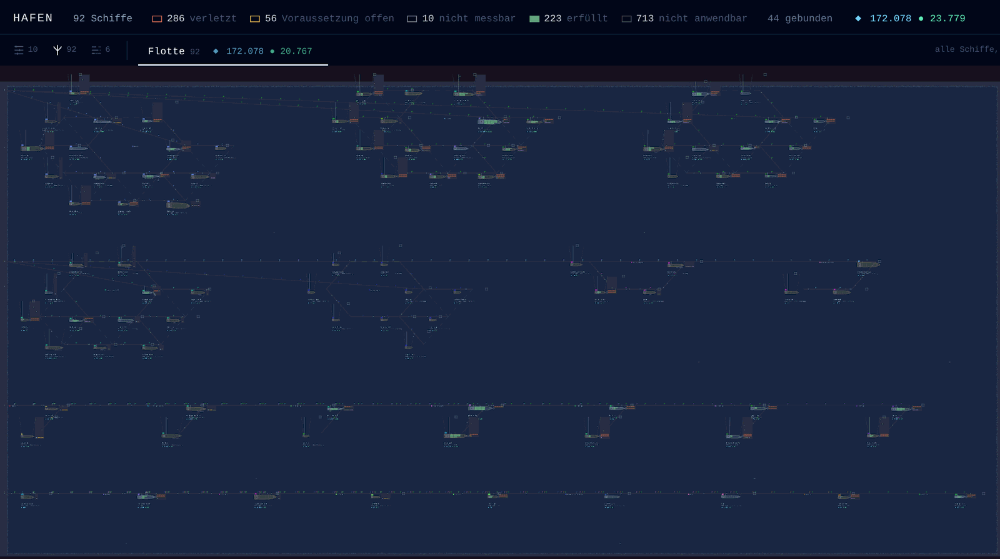
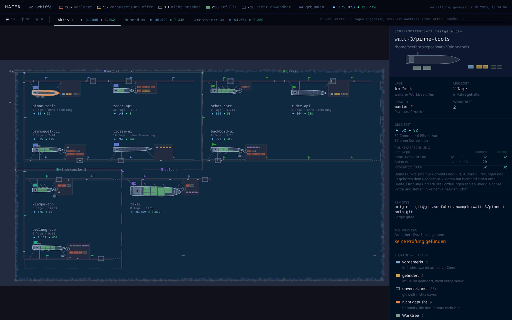
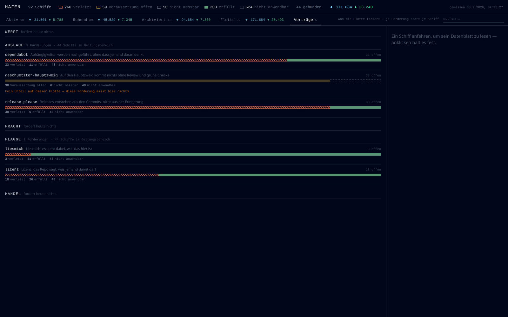

# Hafen

Eine Übersicht über alle Git-Repos einer Maschine: Zustand, Test-Vertrag, und was die Flotte von
ihnen fordert — mit der Evidenz hinter jedem Urteil.



## Wozu

Auf einer Entwicklermaschine liegen irgendwann neunzig Arbeitsbäume, und keine Frage über sie
lässt sich mehr aus dem Kopf beantworten: Welches Repo hat seit einem Jahr niemand angefasst?
Wo liegt Arbeit in einem Stash, die in keinem Commit und in keinem Baum steht? Welches Projekt
hat keine Lizenz, keinen Lint-Schritt, keinen Release-Weg? `ls` beantwortet keine davon, und
`git status` beantwortet sie für genau ein Verzeichnis.

Der Hafen beantwortet sie für alle auf einmal, und zwar **gemessen**:

- **Kein gepflegter Zustand.** Rost kommt aus `git log`, der Test-Vertrag aus den Manifesten, die
  Urteile aus den Forderungen. Ein Statusfeld, das jemand pflegen muss, steht irgendwann falsch da
  — eine abgeleitete Antwort kann das nicht.
- **Jede Antwort trägt ihre Evidenz**: was gefragt wurde, wo nachgesehen wurde, was dort stand
  (`--evidenz`). Ein blankes Urteilswort wäre zu glauben statt zu prüfen.
- **Fünf Urteile, und `nicht messbar` ist keines der anderen vier.** Eine Rust-Crate ohne lesbare
  Prüfung sagt das, statt eine Lücke zu behaupten. Unmessbar ist nicht verletzt.

**Der Hafen misst und zeichnet. Er tut nichts.** Kein Commit, kein Push, keine Netzwerkanfrage,
kein Knopf, der etwas startet. Das ist keine Vorsatzerklärung: `command.spec.ts` prüft jeden
Aufruf gegen eine **Erlaubnisliste** lesender git-Kommandos. Eine Verbotsliste wäre die schwächere
Richtung — mit einer Lücke ließe sie einen Schreibvorgang still durch, die Erlaubnisliste stolpert
im schlimmsten Fall über einen neuen lesenden Aufruf.

Das ist der Punkt, an dem das Vorgängerprojekt gescheitert ist: ein Agenten-Cockpit, in dem jede
Messung die nächste Aufgabe rechtfertigte — 295 Auftragsdateien, und die Projekte, um die es ging,
standen still. Was ein Werkzeug *tun* kann, kostet Aufmerksamkeit. Was es nur misst, nicht.

Dieses Werkzeug läuft in achtzig-plus Arbeitsbäumen, die **nicht alle unsere** sind. Deshalb die
Grenze, und deshalb bleibt der Store lokal.



Jedes Repository ist ein Schiff, und jedes Merkmal eine eigene Messung: die Rumpflänge sind die
Punkte, die Masten die erfüllten Forderungen, der Rost die Liegezeit seit dem letzten Commit, die
Figuren am Steg die Zahl der Autoren. Keine Zusammenfassung zu einer Note — ein großes Schiff mit
verletztem Vertrag soll geschäftig *und* falsch aussehen, nicht mittelmäßig.

## Benutzen

```sh
pnpm install

pnpm hafen hafen                 # alle Schiffe mit Zustand, Lücken und Quests
pnpm hafen hafen --evidenz       # je Quest zeigen, was gelesen wurde
pnpm hafen hafen --json          # maschinenlesbar
pnpm hafen schnappschuss         # Zeitpunkt + Wurzel + Schiffe als JSON
```

Ohne Argument steht die Hilfe da. Die Wurzel ist als zweites Argument überschreibbar, der Store
über `--store=<pfad>` oder `HAFEN_STORE`.

## Installieren

Gebaute Pakete hängen an jedem Release: **[Releases](https://github.com/ulfgebhardt/hafen/releases/latest)**

| Plattform | Artefakt                                            |
| --------- | --------------------------------------------------- |
| Linux     | `.AppImage`, `.deb`, `.rpm`                         |
| macOS     | `.dmg` — Apple Silicon und Intel als eigene Dateien |
| Windows   | `.msi` und `.exe` (NSIS)                            |

Nichts davon ist signiert: macOS und Windows werden beim ersten Start warnen, und das ist ehrlich
so — eine Signatur kostet ein Zertifikat, das dieses Werkzeug nicht hat.

**Das Fenster misst nicht selbst, es ruft die CLI.** Die muss als `hafen` auf dem `PATH` liegen,
oder `HAFEN_CLI` nennt den Aufruf — im Checkout etwa:

```sh
HAFEN_CLI="pnpm --filter @hafen/cli exec tsx src/index.ts" pnpm --filter @hafen/harbor app
```

```
HAFEN  92 Schiffe

in Fahrt  (12)
  seezeichen/bramsegel-ui                     main  Rost 200d
      ! fehlt: typecheck
      ! typecheck       offen: irgendein Schritt dieses Schiffs prüft Typen …
      + e2e             2 von 2 Prüfungen erfüllt
      + lint            2 von 2 Prüfungen erfüllt

QUESTS
  !  136  verletzt
  ~   21  Voraussetzung offen
  ?   44  nicht messbar
  +   63  erfüllt
  ·  270  nicht anwendbar
  44 von 92 Schiffen sind an eine Quest gebunden
```

## Die fünf Urteile

`+` erfüllt · `!` verletzt · `~` Voraussetzung offen · `?` nicht messbar · `·` nicht anwendbar

Fünf und nicht drei, weil **unmessbar nicht verletzt ist**: eine Rust-Crate ohne lesbaren
Lint-Schritt sagt das, statt eine Lücke zu behaupten. Und `nicht anwendbar` ist nicht `erfüllt`:
eine Forderung, die hier nicht gilt, ist keine bestandene.



## Der Katalog

Was die Flotte fordert, liegt als Markdown im Store — `$HAFEN_STORE`, sonst
`$XDG_DATA_HOME/hafen` (also meist `~/.local/share/hafen`):

```
~/.local/share/hafen/
  quests/werft/lint.md              # ein Schritt misst Lint, und die CI ruft ihn auf
  quests/werft/gitignore.md         # .gitignore liegt im Wurzelverzeichnis
  quests/werft/env-ignoriert.md     # sie nennt .env, bevor jemand eine anlegt
  quests/flagge/lizenz.md           # LICENSE, LICENCE oder COPYING — eine davon
  quests/auslauf/release-please.md  # der Release-Weg liegt im Repo
  register.md
```

Die Kette vor der Id ist keine Ordnung zum Sortieren, sondern die aus Konzept §4: `werft` ist
Technik, `auslauf` der Weg nach draußen, `flagge` was das Projekt über sich sagt. Eine Quest
nennt ihre Prüfung im Frontmatter, ihre Begründung im Fließtext, und was sie **nicht** messen
kann, benennt sie als `manuell` — der blinde Fleck soll klein und benannt sein, statt still zu
wachsen.

Der Store bleibt **lokal**. `register.md` führt jedes Repo mit absolutem Pfad, und das ist eine
Liste von Projekten und Kunden — nichts, was in ein öffentliches Repository gehört.

Ein einzelnes Repo darf in `.hafen/quests/` eigene Forderungen ergänzen. **Der Katalog führt:**
eine lokale Quest mit einer Id, die der Katalog schon fordert, wird verworfen — und das steht in
der Ausgabe, damit die Regel sichtbar ist.

## Das Fenster

Das Fenster skaliert sich selbst: `$HAFEN_ZOOM`, sonst `GDK_SCALE`/`GDK_DPI_SCALE`, sonst aus der
tatsächlichen Bildschirmdichte. Gemessen auf dem Panel, für das es geschrieben wurde — 2560×1440
auf 309 mm sind 210 dpi, während X hartnäckig 96 meldet, also Faktor 2,25.

```sh
pnpm --filter @hafen/harbor snapshot   # misst die Flotte in public/snapshot.json
pnpm --filter @hafen/harbor dev        # zeichnet sie
```

Die Flotte als Risszeichnung: ein Rumpf je Repo, das Deck geteilt durch die Forderungen, die für
es gelten. Gefüllt heißt erfüllt, schraffiert verletzt, gestrichelt nicht messbar — **Form und
nicht nur Farbe**, damit die Lesung Graustufen und ein farbenblindes Auge übersteht. Ein Repo
ohne geltende Forderung bekommt ein gestricheltes Deck und keine leeren Kästchen: „nie gemessen"
und „gemessen und leer" dürfen nicht gleich aussehen.

Der Tiefgang ist die Last — ein Schiff, das alles erfüllt, liegt hoch. Die Aufbauten wachsen mit
der Zahl der Forderungen. Sortiert wird nach Zustand, Schlimmstes zuerst; Rost ist zweiter
Schlüssel und nie erster, denn frisch ist nicht dasselbe wie wichtig.

**Daneben steht, was das Repo selbst gerade tut** — zwei verschiedene Fragen, also zwei Orte am
Schiff. Das Deck ist die Forderung der Flotte, Fracht und Flaggen sind der lokale Stand:

| Zeichen            | Bedeutung                   | Zeichen             | Bedeutung         |
| ------------------ | --------------------------- | ------------------- | ----------------- |
| Kiste, gefüllt     | vorgemerkt (staged)         | Wimpel am Mast      | nicht gepusht     |
| Kiste, offen       | geändert                    | Schleifspur am Heck | Remote ist voraus |
| Kiste, gestrichelt | unverzeichnet               | Kisten am Kai       | Stash             |
| Bruch im Rumpf     | Konflikt — hier ist Schluss | Boote längsseits    | weitere Worktrees |
| Haken              | sauber, auf seinem Branch   |                     |                   |

Der Bruch steht für sich, weil ein Konflikt keine schwerere Fracht ist, sondern **gestoppte**
Arbeit. Der Haken ist da, damit „sauber" sichtbar ist statt als Abwesenheit von Zeichen — so
sieht sonst „nicht gemessen" aus.

Auf dieser Maschine gemessen: 25 von 90 Repos haben Stash-Einträge, eines davon 16. Arbeit, die
in keinem Commit und in keinem Baum liegt und die sonst nichts anzeigt.

**Die App misst nicht.** Sie liest `snapshot.json` und sagt in der Kopfzeile, wann der gemessen
wurde — ein Bild ohne seinen Zeitstempel behauptet, aktuell zu sein.

Gezeichnet wird mit PixiJS über WebGL. Der Grund ist gemessen: derselbe Hafen im DOM kostete in
Werft 8,4 % CPU im Leerlauf, und das bei weniger Detail.

## Punkte

```sh
pnpm hafen punkte
```

Zwei Zahlen, nebeneinander und **nie addiert**:

- **Projektpunkte** sagen, was ein _Repository_ angesammelt hat — alle Autoren. Ein geschäftiges
  gemeinsames Projekt steht hoch, und das ist richtig: die Zahl beschreibt das Projekt.
- **Deine Punkte** sagen, was _du_ mit deiner Flotte gemacht hast. Eigene Commits, plus zwei
  Dinge, die kein einzelnes Repository zeigen kann: wie viele Projekte du gleichzeitig hältst
  (_Breite_) und wie viele Bäume du sauber hinterlässt (_Ordnung_).

Die Trennung ist der Punkt: 23 000 Punkte aus einem Projekt mit 110 Mitwirkenden sind keine
persönliche Leistung.

Gewichtet wird nach Conventional-Commit-Typ (`feat` 3, `fix`/`perf` 2, der Rest 1), plus 2 pro
gelandetem Pull Request. Ein Commit ohne Convention zählt trotzdem — eine Null neben 2000 Commits
wäre eine fehlende Konvention und keine Untätigkeit, und wie viele es sind, steht dabei.

PRs werden **lokal** gezählt, ohne die Forge zu fragen: als Menge von Nummern aus Merge-Commits
(`Merge pull request #123`) _und_ Squashes (`… (#123)`). Beide Formen kommen vor, oft im selben
Repo — wer nur Merge-Commits zählt, meldet für ein squash-merging Projekt eine glatte Null.

Der Snapshot trägt die **Rohzahlen**, nicht die Punkte. Eine andere Gewichtung kostet damit keine
neue Messung — was zählt, weil der erste Satz Gewichte immer falsch ist.

Eigene Adressen: `git config user.email`, erweiterbar über `HAFEN_EMAILS` (komma-getrennt). Ohne
eine bekannte Adresse wird **nicht** gescort — jeder Commit zählte sonst als fremder.

## Aufbau

```
packages/core   Messung und Auswertung. Kennt keine Umgebung — alles über Ports.
packages/cli    Node-Adapter und Textausgabe.
apps/harbor     Das Fenster. Liest einen Snapshot, misst nichts.
```

`packages/core` importiert kein `node:fs` und kein `child_process`. Dadurch läuft dieselbe Logik
in der CLI, im Fenster und im Test gegen einen Mock.

Im Fenster gilt derselbe Schnitt noch einmal: `fleet.ts` und `vessel.ts` rechnen aus, _was_
gezeichnet wird — Reihenfolge, Segmente, Tiefgang — und sind zu 100 % gemessen. `scene.ts`
zeichnet nur und ist als einziges von der Coverage ausgenommen, weil über Pixel keine Zusicherung
möglich ist, die kein Screenshot wäre. Der Blindfleck ist damit klein und benannt.

Der Kern stammt aus Werft, einem lokalen Agenten-Cockpit, das nicht weitergeführt wird. Was hier
liegt, ist der Teil davon, der eine Frage an Repositories stellt statt an einen Menschen — und
damit der Teil, der ohne ständige Aufmerksamkeit etwas wert ist.

## Tests

```sh
pnpm test:lint   # eslint + typecheck über alle Pakete
pnpm test:unit   # vitest mit Coverage-Schwellen
```

Tests liegen neben der Datei, die sie prüft (`x.ts` / `x.spec.ts`). Die Schwellen in den
`vitest.config.ts` sind gemessene Werte ohne Luft: ein Punkt Spielraum ist ein Punkt erlaubter
Verfall, und sie zu heben ist ein eigener Commit. Dieselben beiden Kommandos laufen in der CI,
dazu `cargo fmt`, `cargo clippy` und `cargo test` auf Linux, macOS und Windows — der Rust-Teil
ist reines `std`, und dass er auf allen dreien baut, ist eine Aussage, die geprüft wird statt
behauptet.

## Releases

Die Version entsteht aus den Commits, nicht aus der Erinnerung: `release-please` liest die
[Conventional Commits](https://www.conventionalcommits.org/) auf `master`, schlägt den nächsten
Stand als Pull Request vor, und beim Merge entstehen Tag, Changelog und die vier Tauri-Builds.
Deshalb muss ein PR-Titel einem Commit-Typ folgen (`feat:`, `fix:`, `chore:` …) — ein Squash-Merge
mit dem Titel „fixes" landet sonst in keiner Changelog-Zeile.

## Lizenz

Apache-2.0 — siehe [LICENSE](LICENSE).
